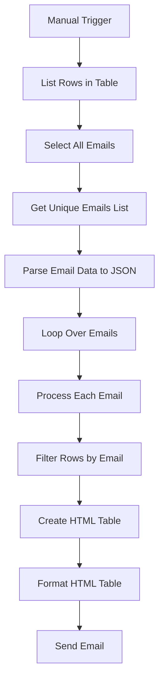

# Power Automate Flow: Notify Customers About Overdue Invoices

This Power Automate flow is designed to notify customers about overdue invoices by sending them a payment reminder email with an attached table of their outstanding invoices.

## Flow Steps

### 1. Trigger: **Manual Trigger**
- The flow is manually triggered by a button in Power Automate.

### 2. Action: **List Rows Present in a Table (Excel)**
- **Location**: OneDrive for Business
- **File**: `Overdue_Invoices_Report.xlsx`
- **Table**: `Tabela1`
- This action retrieves all rows from the specified Excel table containing overdue invoices.

### 3. Action: **Select - 'Select All Emails'**
- **From**: `body('List_rows_present_in_a_table')?['value']`
- **Map**: Selects the `Email` field for each row.
  
### 4. Action: **Compose - Get Only Unique Emails List**
- **Inputs**: `union(body('Select_All_Emails'), body('Select_All_Emails'))`
- This step eliminates duplicate email addresses from the selected list of emails.

### 5. Action: **Parse JSON - Email Data Type into JSON**
- **Content**: `outputs('Compose_-_only_unique_emails')`
- **Schema**:
  ```json
  {
    "type": "array",
    "items": {
      "type": "object",
      "properties": {
        "Email": {
          "type": "string"
        }
      },
      "required": [
        "Email"
      ]
    }
  }
  ```
- This action parses the JSON data containing the list of unique emails.

### 6. Action: **Apply to Each (Loop Over Each Email)**
For each email address in the list, perform the following actions:

#### a. **Compose - Each Single Email**
- **Inputs**: `items('Apply_to_each')['Email']`
- This step composes the email for each individual customer.

#### b. **Filter - Rows for Current Email**
- **From**: `outputs('List_rows_present_in_a_table')?['body/value']`
- **Filter Query**: `item()?['Email'] is equal to outputs('Compose_-_Each_Single_Email')`
- Filters the rows from the Excel table for the current email address.

#### c. **Create HTML Table**
- **From**: `body('Filter_-_rows_for_current_Email')`
- **Columns**: Define custom columns to include in the table.
  - **Customer Name**: `item()?['Customer Name']`
  - **Date**: `item()?['Date']`
  - **Due Date**: `item()?['Due Date']`
  - **Overdue Days**: `item()?['Overdue Days']`
  - **Product Name**: `item()?['Product Name']`
  - **Invoice Ref**: `item()?['Invoice Ref']`
  - **Invoice Net**: `item()?['Invoice Net']`
  - **Currency**: `item()?['Currency']`
- This step creates an HTML table using the filtered invoice data.

#### d. **Compose - Format the HTML Table**
- **Inputs**: Use HTML to format the table with styling.
  ```html
  <html>
    <head>
      <style>
        body {
          font-family: Arial, sans-serif;
          margin: 20px;
        }
        table {
          width: 100%;
          border-collapse: collapse;
          font-size: 14px;
          box-shadow: 0 2px 5px rgba(0,0,0,0.1);
        }
        th {
          background-color: #007ACC;
          color: white;
          text-align: left;
          padding: 12px;
          font-weight: bold;
          border: 1px solid #ddd;
        }
        td {
          padding: 12px;
          border: 1px solid #ddd;
          vertical-align: top;
        }
        tr:nth-child(even) {
          background-color: #f9f9f9;
        }
        tr:hover {
          background-color: #f1f1f1;
        }
      </style>
    </head>
    <body>
      @{body('Create_HTML_table')}
    </body>
  </html>
  ```

#### e. **Send an Email (V2)**
- **To**: `outputs('Compose_-_Each_Single_Email')` (the customer email)
- **Subject**: `Payment Reminder`
- **Body**: `outputs('Compose_-_format_the_HTML_table')` (the formatted HTML table with invoice details)

---

## Setup Instructions

1. **Import the Flow**:
   - Download the `.zip` package containing the flow definition.
   - In Power Automate, go to `My Flows`.
   - Click `Import` and upload the `.zip` file.
   
2. **Configure Connections**:
   - After importing, you'll need to configure the connections:
     - **OneDrive for Business**: Authenticate and provide access to the Excel file (`Overdue_Invoices_Report.xlsx`).
     - **Outlook/Office 365**: Authenticate and provide access to send emails.

3. **Configure File Paths**:
   - **Excel File Path**: Ensure the `Overdue_Invoices_Report.xlsx` file is located in OneDrive for Business and accessible via the flow.
   - **Email Content**: Customize the email body or other dynamic content if needed.

4. **Test the Flow**:
   - Trigger the flow manually to verify it works correctly.
   - Check if the flow retrieves the rows from the Excel file and sends the email with the formatted invoice table.

---

## Notes
- Ensure that the Excel file structure and column names match the flow's expectations.
- Modify the HTML table formatting to suit your needs for email presentation.

---

By following these steps, you will have a flow set up that automatically sends payment reminders to customers with overdue invoices.

# Flow Diagram



